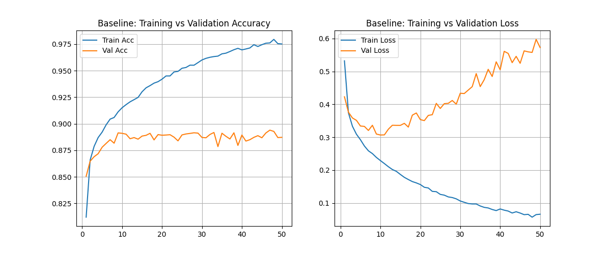
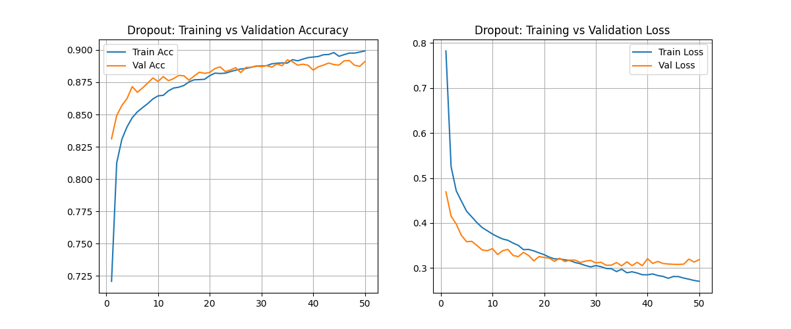
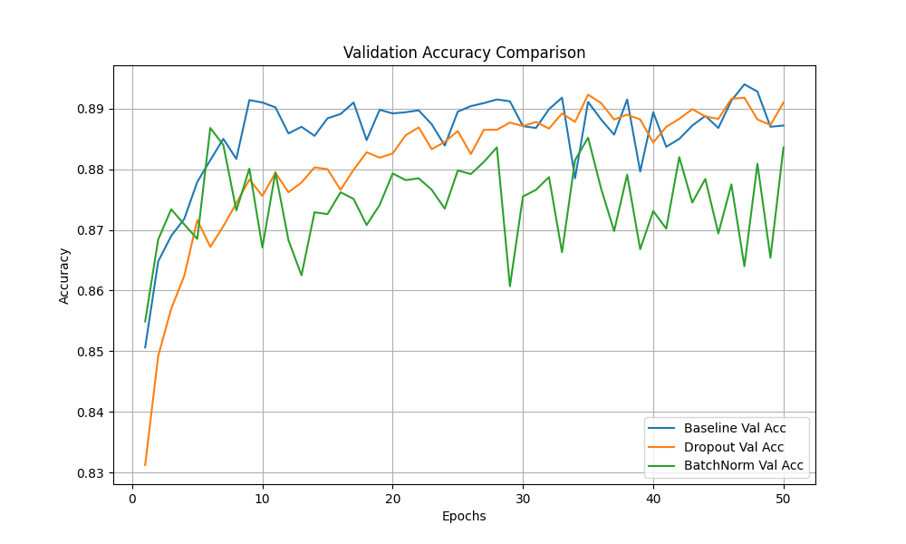
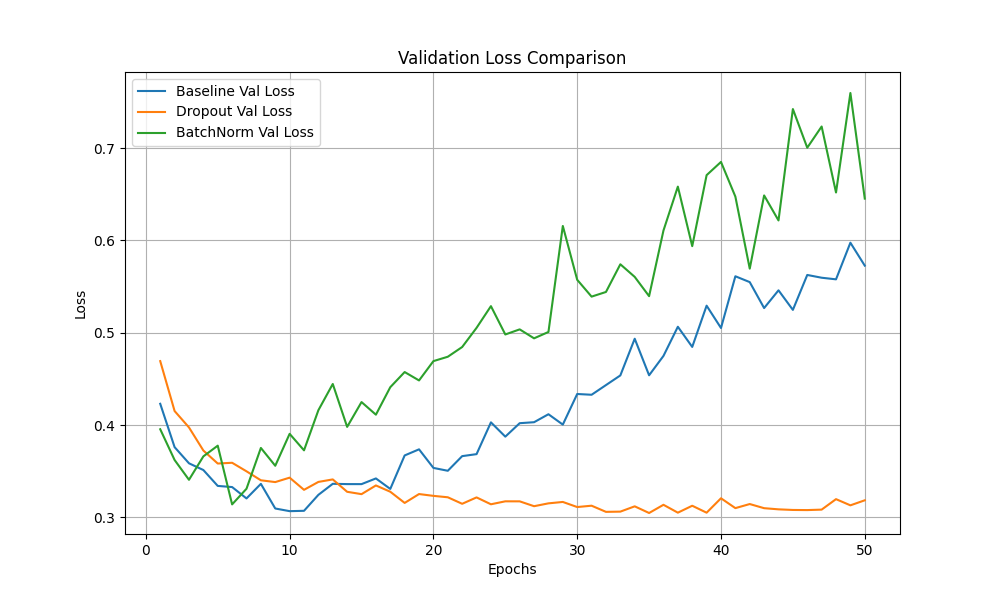

# Deep Feedforward Networks Report

**Roll No.**: [Insert Roll No Here]

## Question 1: Learning Behaviour Analysis

The baseline neural network (2 hidden layers: 256, 128 neurons, ReLU activation) was trained for 50 epochs.

-   **Training vs Validation**: The baseline model achieved a high training accuracy (~94%) but a lower validation accuracy (~89%), indicating overfitting.
-   **Loss Analysis**: As training progressed, the training loss continued to decrease, while the validation loss began to plateau or increase after about 6-8 epochs, further confirming overfitting.
-   **Test Performance**: The final Test Accuracy was very close to the Validation Accuracy, confirming that the validation set was a good proxy for out-of-sample performance.

## Question 2: Dropout

Dropout layers (rate=0.5) were introduced after each hidden layer to improve generalization.

-   **Effect on Overfitting**: Dropout successfully mitigated overfitting. The gap between Training Accuracy (~88%) and Validation Accuracy (~88%) was negligible compared to the baseline.
-   **Performance**: Although the training accuracy was lower than the baseline (due to the added noise making it harder to fit the training data), the validation accuracy remained competitive and the generalization gap was closed.

## Question 3: Batch Normalization

Batch Normalization layers were added before the activation functions of each hidden layer.

-   **Convergence Speed**: The model with Batch Normalization learned significantly faster, reaching high accuracy levels in fewer epochs compared to the baseline.
-   **Training Stability**: The training process was very stable.
-   **Result**: It achieved the highest training accuracy (~97%), but in this specific configuration, it also showed signs of overfitting (Validation loss slightly increasing in later epochs), suggesting it might need to be combined with Dropout or Early Stopping for optimal results.

